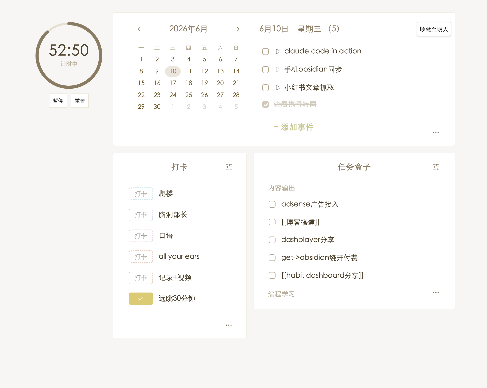
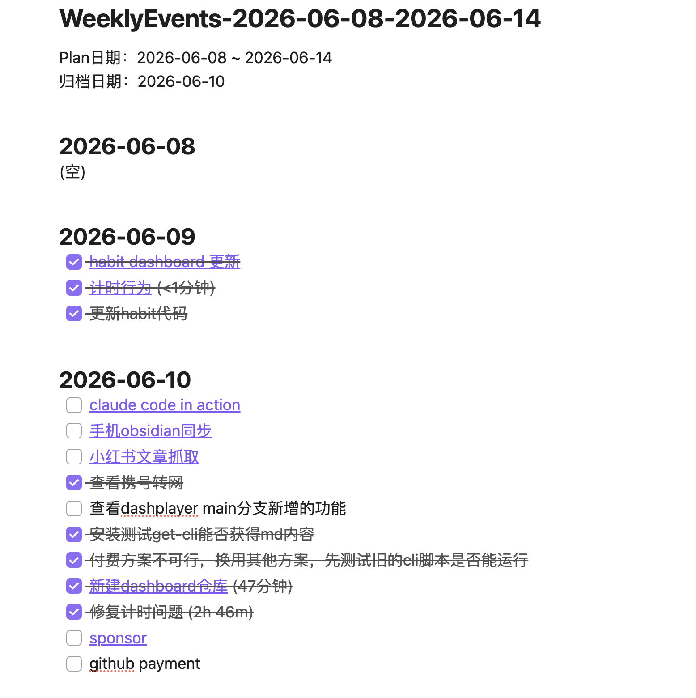
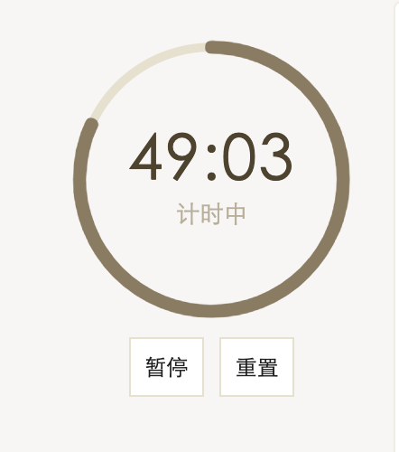
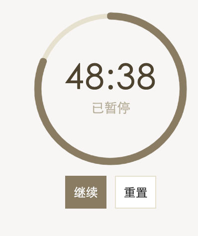
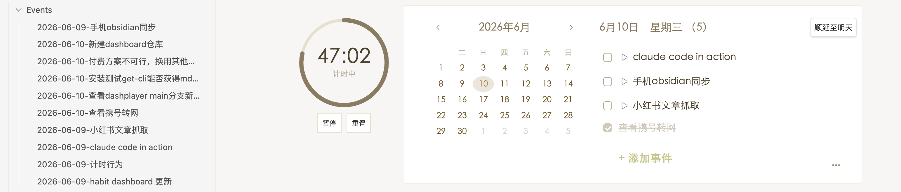
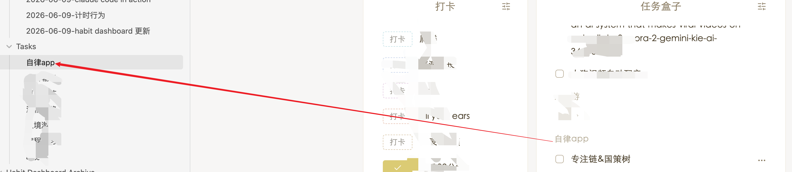
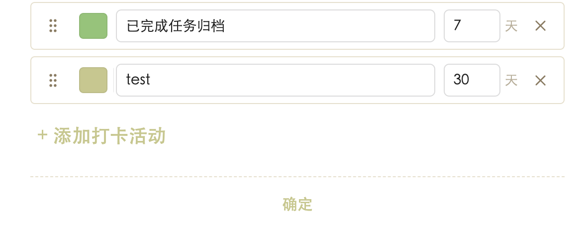

# Habit Dashboard

An Obsidian dashboard plugin that gathers your daily events, data logs, tasks, check-ins, moments, monthly plans, and quick links into one organized page you can view and edit at a glance.

## Features

- **Calendar + Daily Events** — A month mini-calendar lets you switch the focused date; the events column on the right manages today's items, and the More button opens a weekly view that supports archiving. Each event can link to its own Markdown note (auto-created under `Habit Dashboard/Events/`) — click the title to open it, click ▶ to mark it started, and postpone unfinished events to tomorrow (one at a time, or all at once from the weekly view). Archived weeks show task duration and link back to the note.

- **Timer** — A standalone countdown timer pinned to the left sidebar (60 minutes by default, not tied to any task). Click the time display to set a custom duration, then Start / Pause / Resume / Reset — it keeps running even after closing and reopening Obsidian, and shows a notice when time's up.

 

- **Data Log** — Record daily metrics such as weight, words written, sleep, expenses, etc. Browse the monthly history and archive it as a note.
- **Task Box** — Organize tasks by category boxes. Add quickly from the dashboard, or open the full task view for everything. Each box can link to a Markdown note under `Habit Dashboard/Tasks/` — its `## 子任务` checklist stays in two-way sync with the in-app task list.

**Daily events linked to notes** (left sidebar shows the auto-created files under `Habit Dashboard/Events/`):

**Task box item linked to a note** (clicking the task opens its file under `Habit Dashboard/Tasks/`):

- **Check-in** — Customizable colored buttons for habits; the monthly view shows your streak. Set a custom cycle per habit (e.g. every 3 days) — items not yet due are hidden from today's view but remain visible in history.

- **Daily Moments** — Capture timestamped notes throughout the day with 12/24-hour support.
- **Monthly Planner** — Outline this month's plans, browse the entire year in the yearly view, and archive.
- **Quick Links** — Hover the bottom blank area of either column to add a quick link with a custom name and color that jumps to a chosen note.

## Installation

### BRAT (recommended)

1. Install the [BRAT](https://github.com/TfTHacker/obsidian42-brat) community plugin.
2. In BRAT settings, choose **Add Beta Plugin** and enter `ghh-l-djl/obsidian-habit-dashboard`.
3. Enable **Habit Dashboard** in Community plugins.

### Manual install

1. Download `main.js`, `manifest.json`, and `styles.css` from the latest GitHub release.
2. Place them inside your vault at `.obsidian/plugins/habit-dashboard/`.
3. If the folder doesn't exist, create `habit-dashboard` under `plugins`.
4. Enable the plugin in Obsidian.

> Note: `main.js` already bundles every module from `lib/` into a single file. For deployment **only those three files** are required — you don't need to copy `lib/`, `src/`, `tests/`, or `scripts/`.

## Usage

1. Click any date in the mini-calendar to switch focus; use the chevrons to change month.
2. Daily events support checkboxes, click-to-edit, and right-click for delete/copy/paste. The More button opens the weekly view.
3. In Data Log, click a value to edit it (Enter to commit). The `...` button opens the monthly history with archive support.
4. In Task Box, the right-top settings button manages categories; pick a category from the dropdown when adding a task on the dashboard.
5. Check-in buttons toggle today's status with one click. Color comes from the activity setting.
6. Daily Moments respects 12/24-hour format; existing entries follow the active format. Use the Daily Summary button to create or open a per-day summary note.
7. Monthly Planner's yearly view lists all 12 months; archive a year as a single note.
8. Hover the bottom blank area of a column to reveal `+ Quick link` and configure a button. Drag a quick button to reorder; right-click to delete.
9. Click ▶ next to an incomplete event to mark it started and record the start time. Use the postpone button to push an unfinished event to tomorrow, or "Postpone" in the weekly view to push all unfinished events for that day at once.
10. Events and task-box items created from the dashboard are linked to a Markdown note (under `Habit Dashboard/Events/` or `Habit Dashboard/Tasks/`). Click the title to open the note; renaming the note renames the item; editing the `## 子任务` checklist in a task-box note syncs tasks both ways.
11. The Timer section in the left sidebar runs independently of tasks — click the time display to set a custom duration, then Start / Pause / Resume / Reset.

## Settings

- **Interface language** — Chinese / English (Chinese defaults to 24-hour, English defaults to 12-hour).
- **Section length** — Medium / Long; controls how many items each section displays on the dashboard.
- **Time format** — 12 or 24 hour (affects Daily Moments).
- **Quick link open mode** — Smart / always new tab / replace current tab.
- **Archive folder** — Where archive notes are saved (created if missing).
- **Dashboard sections** — Toggle individual sections (including Timer) on or off.
- **Check-in cycle** — Per habit, set how many days between check-ins (default 1 = every day). Items not yet due are hidden from today's view but still appear in the monthly history.

## Compatibility

- Minimum Obsidian version: see `minAppVersion` in `manifest.json`.
- **Desktop and mobile (phone & tablet)** — The plugin runs on Obsidian desktop and on Obsidian Mobile with a tab-based layout (daily / trackers / tasks / links). `manifest.json` sets `isDesktopOnly` to `false`.

## Development

- Source entry: `src/main.js`. Business modules live in `lib/`; section renderers under `lib/sections/`.
- Unit tests: `npm test` (built on Node's built-in `node:test`).
- Bundle: `npm run build` — a zero-dependency bundling script that emits a single `main.js` to the project root.

## Feedback & Contributions

## Credits

This plugin is a modified version of [Yori Dashboard](https://github.com/yoriGo77/obsidian-yori-dashboard) by yoriGo77, used and redistributed under the MIT License with attribution preserved (see `LICENSE`).

## License

MIT — see `LICENSE` in the repository root.
